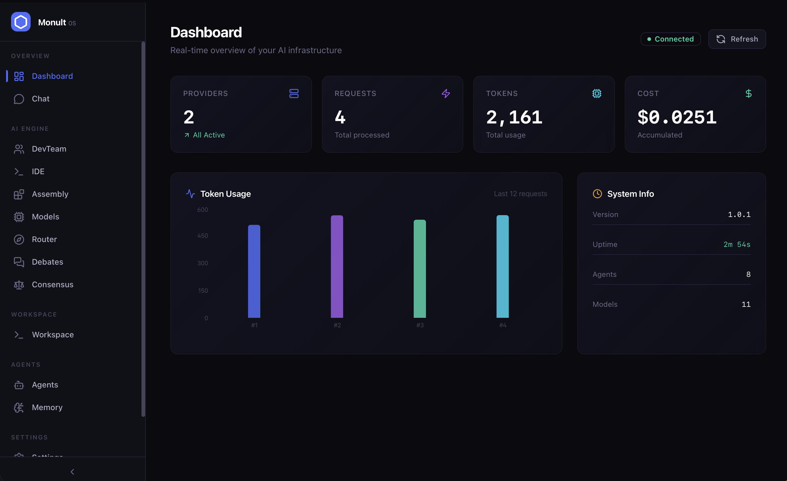

<div align="center">

# 🧠 Monult

### Multi-Model AI Operating System for Developers

[](https://opensource.org/licenses/Apache-2.0)
[](https://www.typescriptlang.org/)
[](https://nodejs.org/)
[](CONTRIBUTING.md)

**Stop calling a single AI model. Start running collaborative AI assemblies.**

Monult orchestrates multiple AI models and agents to collaborate, debate, verify, and deliver consensus-driven results like a dedicated team of AI engineers working together on your codebase.

[Quick Start](#quick-start) · [Features](#features) · [Architecture](#architecture) · [Documentation](#documentation) · [Contributing](#contributing)

</div>

---

## 🛑 The Problem

Today's AI development is deeply fragmented:

- **Single model dependency** — locked into one provider's strengths and weaknesses.
- **No verification** — AI answers go unchecked, leading to hallucinations in production logic.
- **No collaboration** — models work in isolation, missing the emergent benefits of diverse reasoning.
- **Manual orchestration** — developers are forced to glue together fragile API calls without structure.
- **No memory** — every conversation starts from scratch, forgetting project context.

## 🚀 The Solution

Monult is an **AI orchestration runtime** that elegantly manages models, agents, context memory, tools, cost optimization, and developer workflows. Instead of calling a single model, you run **AI assemblies** where multiple models and specialized agents collaborate organically.

## AI Assembly Flow
```text
Developer Request
  → Monult Runtime
    → Model A proposes a solution (e.g., Claude)
    → Agent B critiques it (e.g., Security Agent)
    → Model C improves it (e.g., OpenAI o3)
    → Model D verifies it (e.g., Cohere)
  → Verified, consensus-driven answer
```

---

## Monult Dashboard



Monult includes a beautiful, real-time web dashboard to visualize token usage, live agent debates, and cost optimization metrics out of the box.

## AI Assembly Demo


---

## Quick Start

### Installation

```bash
# Install globally via npm
npm install -g monult
```

### Setup Workspace

Initialize Monult, configure your AI providers, and set up a context boundary workspace.

```bash
# Initialize a new project (.monult.json)
monult init

# Configure providers globally or locally
monult provider add openai
monult provider add claude

# Create a workspace to isolate project memory
monult workspace create "my-app"
```

### Essential CLI Commands

```bash
# Get a quick answer using the default provider
monult ask "Design a scalable REST API"

# Run a full DevTeam collaboration (Architect, Frontend, Backend, Security)
monult devteam "Build an authentication system"

# Analyze a codebase and get heuristic suggestions
monult analyze ./my-repo

# Run agent assembly specifically
monult agent-assembly "Design a scalable backend"

# Run hybrid assembly (models + agents)
monult hybrid-assembly "Secure login system" -m claude,openai -a architect,security

# Run a specific agent with tools
monult agent run debugger --input "fix auth bug"

# Manage workspaces
monult workspace list
monult workspace get <id>

# Run JSON-based automated workflows
monult workflow run pipeline.json

# Start the dashboard and API server
monult start --port 3000
```

### Universal SDK

Monult exposes a robust, typed SDK to orchestrate models programmatically within your applications.

```typescript
import { UniversalSDK, AssemblyEngine, HybridAssemblyEngine } from 'monult';

const monult = new UniversalSDK({
  providers: {
    openai: { apiKey: process.env.OPENAI_API_KEY },
    claude: { apiKey: process.env.ANTHROPIC_API_KEY },
    gemini: { apiKey: process.env.GOOGLE_API_KEY },
  }
});

// 1. Simple Generation
const result = await monult.generate({
  model: 'claude',
  prompt: 'Explain recursion with a real-world example'
});

// 2. Multi-Model Assembly (Debate & Verification)
const assembly = new AssemblyEngine(monult);
const result = await assembly.run({
  models: ['claude', 'openai', 'gemini'],
  debate: true,
  verify: true,
  prompt: 'Design a scalable event-driven backend architecture'
});

console.log(result.consensus);    // Best consensus answer
console.log(result.confidence);   // Confidence score assigned by the engine
console.log(result.reasoning);    // Full debate reasoning trace

// 3. Hybrid Assembly (Models + Agents)
const hybrid = new HybridAssemblyEngine(monult);
const hybridResult = await hybrid.run({
  models: ['claude', 'openai'],
  agents: ['architect', 'security'],
  prompt: 'Design a secure authentication system'
});
```

---

## 🌟 Features

### 🔌 Universal AI SDK
Connect to any AI provider through a unified API. Built-in support for **Claude**, **OpenAI**, **Gemini**, **Cohere**, and **Local LLMs (Ollama)** — plus a dynamic registration system for custom providers.

### 🏗️ AI Assembly Engine
Multiple models collaborate in structured pipelines: `propose` → `critique` → `improve` → `verify` → `merge`.

### 🔀 Hybrid & Agent Assembly
## Agent Collaboration

Agents (Architect, Security, DevOps, etc.) and Models collaborate together organically. Models handle reasoning, and agents handle specific domain critiques and improvements.

### ⚔️ AI Debate & Consensus Engine
Models actively argue for different approaches. The system rigorously tracks arguments, counterarguments, and improvements, then utilizes weighted voting and confidence-based selection to determine the definitively best response.

### 🧭 Smart Model Router & Cost Optimizer
Automatically picks the optimal model based on task type complexity, latency restrictions, designated cost budget, and accuracy needs.

### 📊 Model Benchmarker
Built-in tooling to benchmark different models and providers to determine latency, token consumption, and general response heuristics seamlessly.

### 🧠 Persistent Memory & Workspaces
Vector-based memory system strictly scoped using Workspaces. Layers include conversation, project, tool, and knowledge memory.

### ⚙️ Declarative Workflow Engine
A declarative, JSON-based execution engine that strictly links models, agents, and assemblies together into automated, deterministic pipelines.

### 🧩 Plugin & Tool System
Extensible architecture allowing the community to build custom providers, memory sources, and command plugins. Built-in tools feature advanced code analysis, documentation parsing, repository reading, database analysis, and automated web search.

### 🛡️ Security Engine
Proactive protection against prompt injections, API key leakage, malicious code suggestions, and unsafe project dependencies.

---

## 🧱 Architecture

Monult is built as a highly modular, scalable framework:

```text
monult/
├── src/
│   ├── core/                  # Core engines (SDK, Assemblies, Router, Cost, Workspace)
│   ├── providers/             # Adapters (OpenAI, Claude, Gemini, Cohere, Local)
│   ├── memory/                # Context management and Vector stores
│   ├── agents/                # Agents (Architect, Debugger, DevOps, Security, Docs)
│   ├── tools/                 # Tools (FS, Repo Scanner, Web Search, Code Analyzer)
│   ├── security/              # Security Engine (Injection detection, Key leaking prevention)
│   ├── plugins/               # Extensibility architecture
│   ├── cli/                   # Modular Commander.js CLI System
│   ├── api/                   # Express REST API
│   └── index.ts               # Package Exports
├── dashboard/                 # Next.js Analytics & Control Dashboard
└── docs/                      # Deep-dive documentation
```

---

## 📚 Documentation

Review our comprehensive guides to get the most out of Monult.

| Document | Description |
|----------|-------------|
| [Architecture Overview](docs/architecture.md) | High-level system design and module relationships |
| [Quick Start Guide](docs/quickstart.md) | In-depth setup and getting started guide |
| [API Reference](docs/api-reference.md) | Full REST API documentation |
| [Agent Framework](docs/agents.md) | How to build, run, and orchestrate Agents |
| [Assembly Engines](docs/assemblies.md) | Deep dive into Debate, Verification, and Consensus |
| [Hybrid Assemblies](docs/hybrid-assembly.md) | Mixing Models and Agents for optimal results |
| [Model Router & Cost](docs/model-router.md) | Configuring the Smart Router and Cost Optimizer |
| [Security Engine](docs/security-engine.md) | Protecting your application from AI vulnerabilities |
| [Dashboard](docs/dashboard.md) | Running and utilizing the Next.js control panel |
| [Plugin Development](docs/plugins.md) | How to extend Monult's capabilities |

---

## 🗺️ Roadmap

- [x] Multi-provider SDK (Claude, OpenAI, Gemini, Cohere, Local)
- [x] AI debate and consensus system
- [x] Smart model router & cost optimization
- [x] Agent framework with specialized built-in agents
- [x] Agent Assembly & Hybrid Assembly
- [x] Model Benchmarking system
- [x] Persistent Memory and Workspace context isolation
- [x] CLI interface & Declarative Workflows
- [x] REST API & Next.js Web dashboard
- [ ] Distributed remote assembly execution
- [ ] Native Fine-tuning integrations
- [ ] IDE extensions (VS Code, JetBrains)
- [ ] Cloud-hosted Monult Enterprise service

---

## 🤝 Contributing

We actively welcome contributions! Monult relies on its community to build the most resilient AI operating system. 

Please see the [CONTRIBUTING.md](CONTRIBUTING.md) guide for comprehensive details on:
- Project Setup
- Development Workflow
- Code Style Rules
- Guides on adding Providers, Agents, Tools, and Plugins.

---

## 📜 License

Monult is open source software licensed under the **Apache License 2.0**.

You are free to use, modify, and distribute this project in accordance with the license.

Original Author: Rohan Vanvi

---

<div align="center">

**Built for developers who demand accuracy, verification, and collaboration from AI.**

⭐ Star this repository if you believe in multi-model orchestration!

</div>
